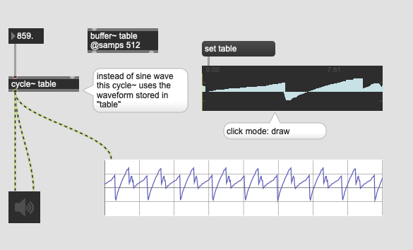
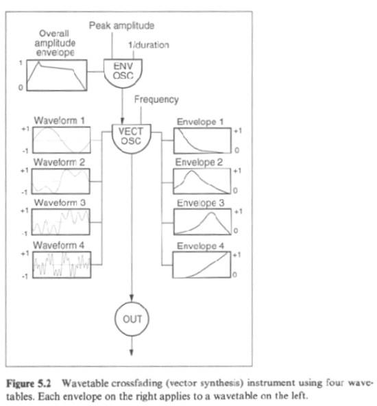
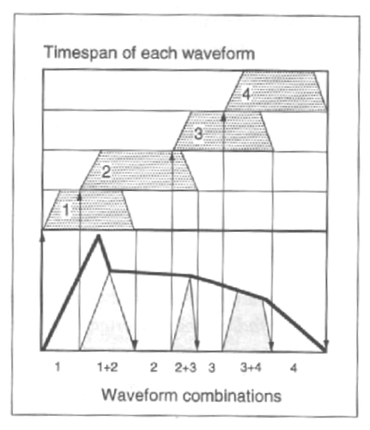
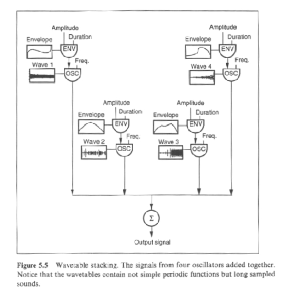

# K2: Wavetable synthesis

## Table-lookup synthesis

### Assignment 1

Fill the table with a saw tooth wave programatically and generate saw tooth wave from cycle~.

### Assignment 2

The waveform output from cycle~ won't be change even if the content of buffer~ "table" is changed. Solve this problem by replacing cycle~ with another object and update the waveform in realtime.

Hint: wave~

---
## Sample-based Synthesis

Sample-based synthesis uses recorded waveforms instead of scientifically created waveforms (sine, triangle, or saw) in the context of wavetable synthesis.

### Assignment 3

Load the [Flute sample](K2/flute60.wav) onto the patch, observe the waveform of the recorded flute sound e.g. using waveform~, find the repetition of the waveforms in it.

Then, use one cycle of the flute's waveform instead of manually or programatically created waveform in table-lookup synthesis; This is the fundamental of the sample-based synthesis.

---

## Wavetable crossfading

The problem of Wavetable synthesis is that the timbre is too static in comparison with very dynamic timbre of acoustic instruments. To achieve the dynamism of acoustic instruments, we could use more than one waveform and crossfade them.

### Assignment 4
Implement Wavetable crossfading with 4 different wavetables (you could also use cycle~, saw~, tri~ etc.) with 4 different envelopes for each waveform and the overall amplitude envelope.

---

## Wavetable Stacking

Wavetable crossfading use multiple one-cicle waveforms and synthesize them. However, in wavetable stacking, we just use samples instead of one-cicle waveforms.

### Assignment 5

Download two [samples](K2/samples.zip) of piano and flute and implement simple wavetable stacking. In the patch, the pitch should be controllable between MIDI note number 48 and 72.

