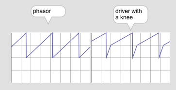
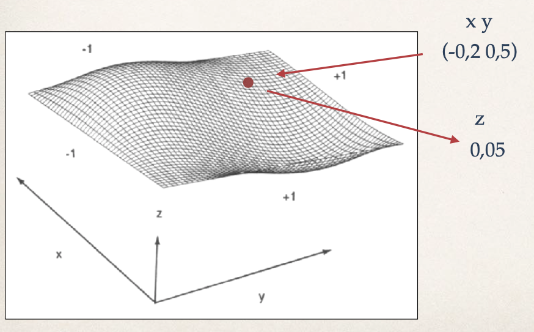

# K2: Wavetable synthesis

## Table-lookup synthesis

### Assignment 1

Fill the table with a saw tooth wave programatically and generate saw tooth wave from cycle~.

### Assignment 2

The waveform output from cycle~ won't be change even if the content of buffer~ "table" is changed. Solve this problem by replacing cycle~ with another object and update the waveform in realtime.

Hint: wave~

---
## Sample-based Synthesis

Sample-based synthesis uses recorded waveforms instead of scientifically created waveforms (sine, triangle, or saw) in the context of wavetable synthesis.

### Assignment 3

Load the [Flute sample](K2/flute60.wav) onto the patch, observe the waveform of the recorded flute sound e.g. using waveform~, find the repetition of the waveforms in it.

Then, use one cycle of the flute's waveform instead of manually or programatically created waveform in table-lookup synthesis; This is the fundamental of the sample-based synthesis.

---

## Wavetable crossfading

The problem of Wavetable synthesis is that the timbre is too static in comparison with very dynamic timbre of acoustic instruments. To achieve the dynamism of acoustic instruments, we could use more than one waveform and crossfade them.

### Assignment 4
Implement Wavetable crossfading with 4 different wavetables (you could also use cycle~, saw~, tri~ etc.) with 4 different envelopes for each waveform and the overall amplitude envelope.

---

## Wavetable Stacking

Wavetable crossfading use multiple one-cicle waveforms and synthesize them. However, in wavetable stacking, we just use samples instead of one-cicle waveforms.

### Assignment 5

Download two [samples](K2/samples.zip) of piano and flute and implement simple wavetable stacking. In the patch, the pitch should be controllable between MIDI note number 48 and 72.

---

## Phase-Distortion Synthesis

We can separate wavetable and its **driver** using cycle~'s right inlet.

In the patch above the driver is a simple phasor ,but we can use different signal as a driver.
For example, in the patch below, we modify the phasor signal by pow~ and bend the driver signal. As a result, the output from cycle~ is also distorted accordingly.

### Assignment6
Phase Distortion synthesis uses a special driver signal with a "knee". The ramp before the knee is faster and the point of knee is controllable.

- Study "kink~" object and implement phase distortion synthesis.
- Use table other than cosine wave and extend the concept of phase distortion synthesis

## Wave Terrain Synthesis

With Phase Distortion synthesis we learned that we can separate table and driver and control them separately. Wave terrain synthesis brings the idea of this two-way freedom in 3 dimensional field as shown in the figure below.

In Wavetable synthesis, the wavetable is depicted in 2D space and with a driver we give X value and get Y value.

In Wave terrain synthesis, the wave terrain is depicted in 3D space and with a driver we give X Y value and get Z value.

### Optional Assignment:
Try implementing wave terrain synthesis in Max.
Hint: jit.matrix would be useful to store the wave terrain. jit.peek~ also comes in handy to refer to the data stored in jit.matrix as an audio signal. 
