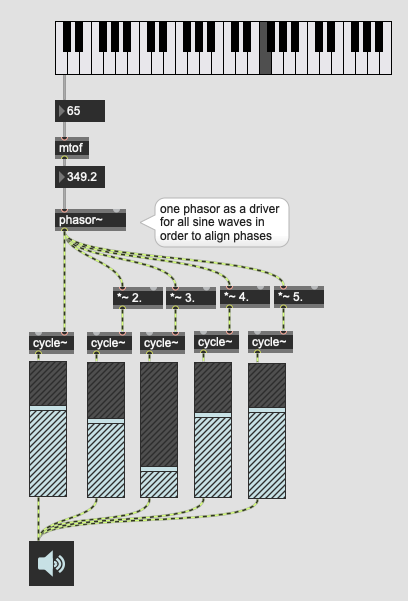

# K3: Additive/Subtractive Synthesis

## Additive Synthesis

Additive synthesis is a sound synthesis technique that creates timbre by adding sine waves together.

The timbre of musical instruments can be considered in the light of Fourier theory to consist of multiple harmonic or inharmonic partials or overtones. Each partial is a sine wave of different frequency and amplitude that swells and decays over time due to modulation from an ADSR envelope.

Basic additive synthesis patch (up to 5th harmonic)

### Assignment 1
Apply different fixed length envelope (for example using function and line~) to each partial of the patch above.

### Assignment 2
On top of assignment 1, modify 2, 3 ,4 and 5 in the *~ objects to some random float numbers and create an inharmonic additive synthesizer.

### Assignment 3
Add two knobs to the patch for vibrato.
- a knob controls the speed of vibrato (1 ~ 20 Hz)
- the other knob controls the depth of vibrato (0 to 100 cents where 100 cents = 1 semitone)