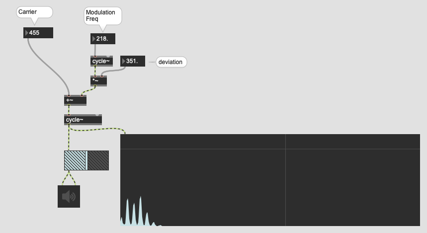
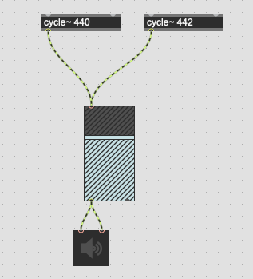
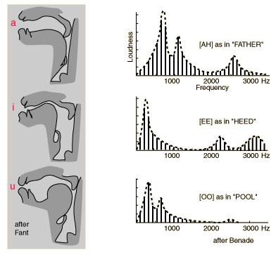
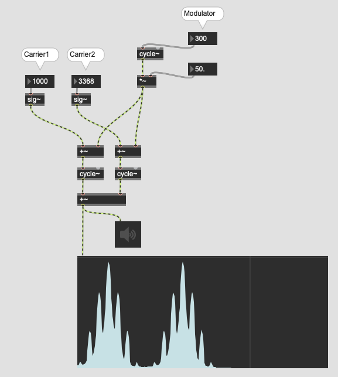
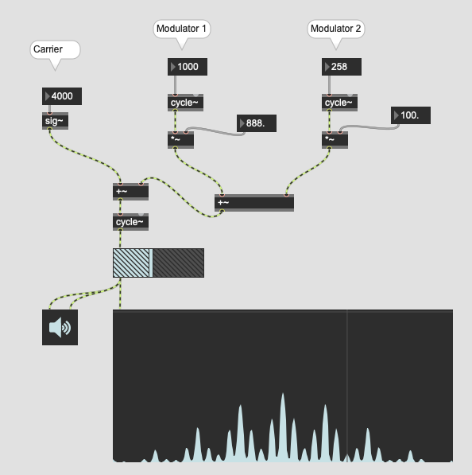
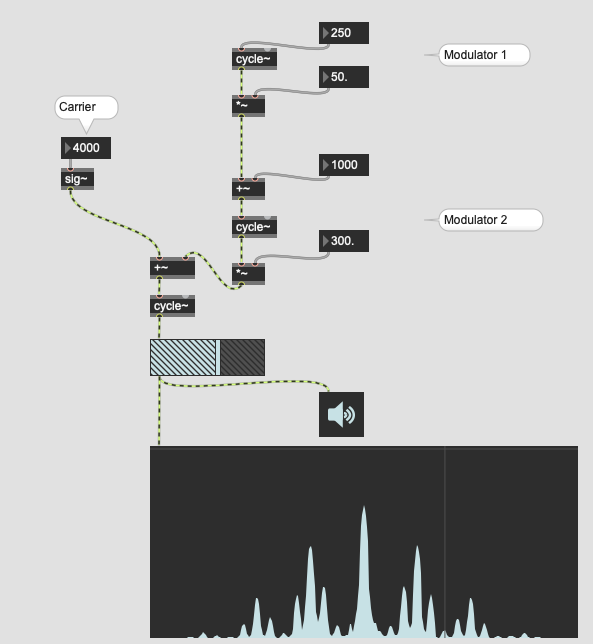

# K5: Modulation Synthesis (2)

## Exponential FM

Normal digital FM: use frequency as carrier / modulation  
Our perception of pitch: exponential

- A4 = 440 Hz  
- A5 = 880 Hz  
- A6 = 1760 Hz

If we interpret FM as a special **vibrato**. The frequency range for the vibrato against A6 should be **wider** than A4 to obtain the same effect.

### Assignment 1
How can we retain the same vibrato effect against all kind of carrier frequency? implement the solution by modifying the patch below.

Hint: mtof/ftom

## FM and Beating

### Beating
In acoustics, a beat is an interference pattern between two sounds of slightly different frequencies, perceived as a periodic variation in volume whose rate is the difference of the two frequencies.

### FM and beating
Since FM generates aliasing by adding more and more sidebands, it is inevitable to create some beating by giving specific parameters to carrier frequency, modulation frequency and modulation index.

### Assignment 2
Find three different combination of 

- carrier frequency
- modulation frequency
- modulation index

that generates beatings 

## FM and formant
The spectrum of FM is similar to that of human voice.
If we observe the spectrum of human voice, we see a group of partials that a mountain-shaped. They are called **formant**. 
The spectrum that FM synthesizer creates is very similar to those formant. Thus, we can imitate human voice (vowels) to some extent using FM synthesizers.

### Assignment 3
Use one or multiple FM synthesizers and create a sound that resembles human voice e.g. "ah", "e" or "i".

## More than one carrier or one modulator
In FM, it is possible to use more than one carrier or modulator,  against one or more than one carrier or modulator.

### MCFM (Multiple Carrier Frequency Modulation)

It is possible to use multiple carrier against one modulator. It is called MCFM. In this case, sidebands are generated around those two carriers.

### MMFM (Multiple Modulator Frequency Modulation)

It is possible to use multiple modulator against one carrier. It is called MMFM. 
There are two ways to implement MMFM namely PMMFM (parallel multiple modulator frequency modulation) and SMMFM (seril multiple modulator frequency modulation).

#### PMMFM

in PMMFM the output of modulator 1 and 2 are added and applied to carrier. In the spectrum we can observe the second generation of 
the sidebands.

#### SMMFM

in SMMFM the output of modulator 1 is sent to modulator 2 as if it were the carrier. The output of modulator 2 is applied to the carrier.

### Assignment 4
Compare PMMFM and SMMFM and find out the functional difference. Discuss the advantage and the disadvantage of each approach.

