# K7: Formant Synthesis

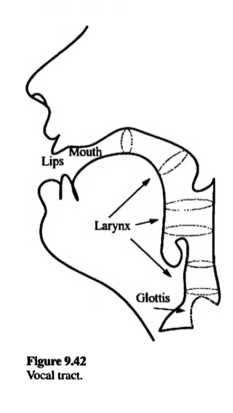

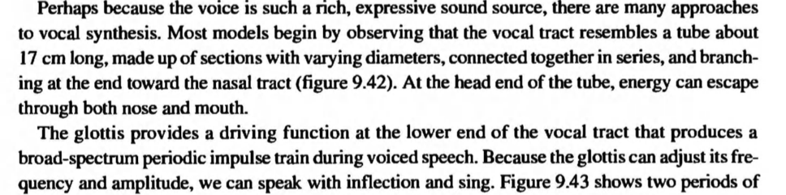

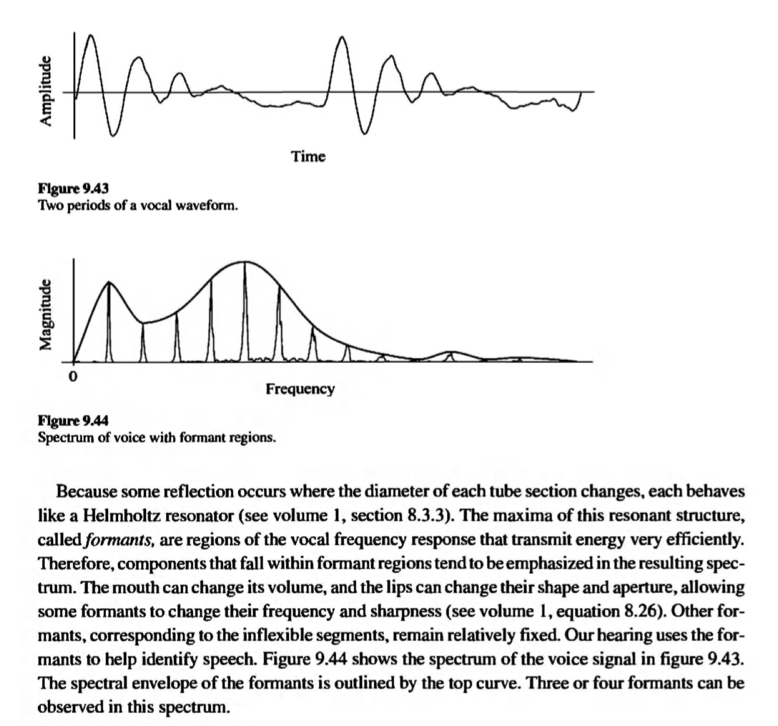

### Formant

- A Formant is a peak of energy in a spectrum, which can include both harmonic and inharmonic partials as well as noise. 

- Formant peaks are a characteristic of the spoken vowel sounds and the tone color of many musical instruments.

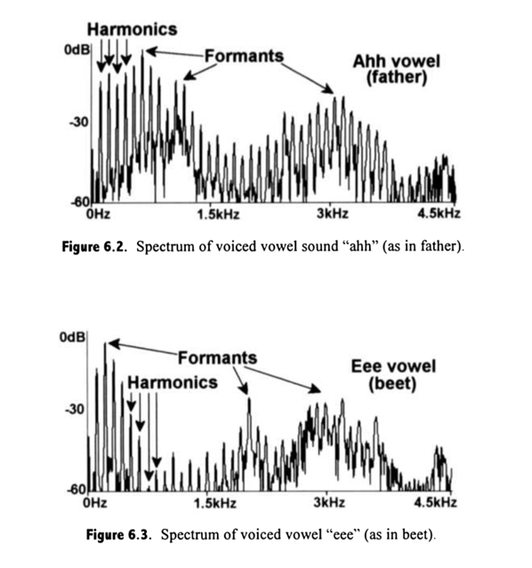

### Formant Creation with AM

#### AM

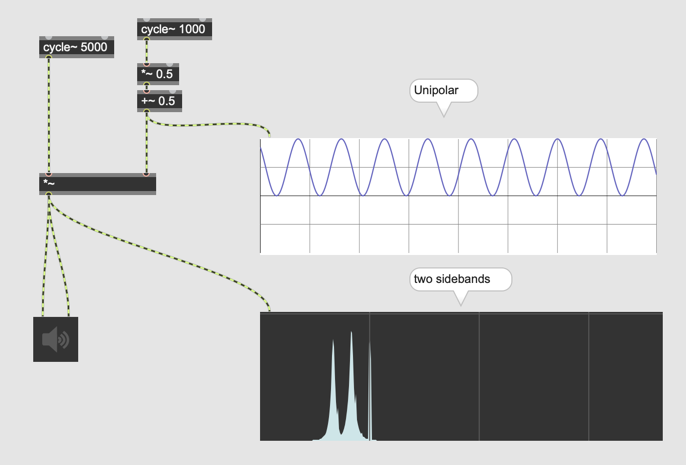

### Assignment 1

The modulator of the AM synthesis generates a unipolar signal. This is a useful tool to imitates formant but the number of sideband is limited to 2. By calculating this unipolar signal to the **Nth** power, we can interpolate unipolar sine wave and impulse.

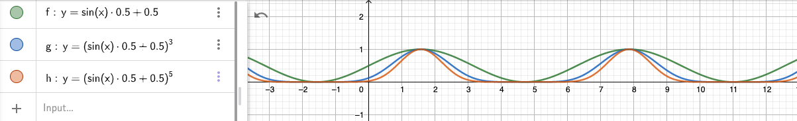

By Applying this **exponential AM** to the carrier signal, we can generate more sidebands from AM.

Add a number box to the AM patch and implement the exponential AM to control the number and the strength of sidebands. Then, observe the spectral transition when N = 1, N = 3 or N = 5.

### VOSIM

Vosim = Voice Simulator

> The VOSIM waveform approximates the signal generated by the human voice in the form of a series of pulse trains, where each pulse is the square of a sine function. 
>

#### VOSIM Parameters

- The parameter A sets the amplitude of the highest pulse.
- Each of the pulse trains contains N sin^2 pulses in series
- The pulses decreases in amplitude by a decay factor b
- The width (duration) of each pulse T determines the position of the formant spectrum
- A variable-length delay M follows each pulse train
- The period is N x T + M

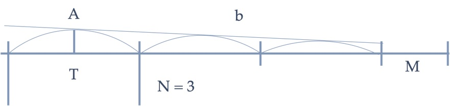

### Assignment 1: squard sine

Implement squared sine wave oscillator and generate an unipolar squared sine wave as illustrated below.

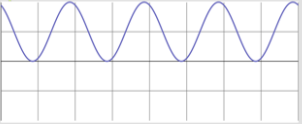

- The squared sine wave should be unipolar
- The pulse width T parameter should be controllable by a number box (T is samples not the freqeucny)

Hints:  
- sinx~ ... outputs sine value by giving radian value
- count~ ... generates numbers from x to y and outputs them as an audio signal

### Assignment 2: delay

Add one more number box to the patch of assignment 1 and allow the user to control D (delay) parameter.

After the implementation, the patch should be able to generate squared sine wave followed by a certain amount of "pause" as illusrated below.

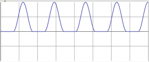

Hints:
We need to evaluate if the sample index in one cycle is above T (pulse with) or not.

### Assignment 3: N pulses
VOSIM allows the user to generate N squared sine impulse before entering the "pause" phase of the period. Add one more number box to the patch of assignment 2 and enable the user to control the number of squared sine impulses per period.

After the implementation, the patch should be able to generate the audio signal illustrated below.

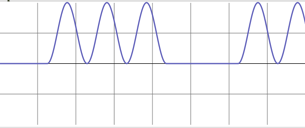

### Assignment 4

Add one more number box to the patch of assignment 3 and enable the use to control the decay factor b. 

factor b determines the reduction of amplitude per impulse. e.g. if factor is 0.2, The amplitude of impulses will be

- 1st impulse = 1.0
- 2nd impulse = 0.8
- 3rd impulse = 0.6
... 
etc.

Note, the amplitude of impulse cannot be negative even if the user specify very high decay factor.

After the implementation, the patch should be able to generate audio signal illustrated below.

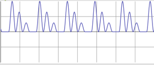

## Window Function Synthese

Formant is often generated by generating sideband but the sideband has a big technical problem, namely **aliasing**. If the number of sidebands or overtones doesn't change even if the carrier frequency is very high, there would be higher chance to generate aliasing.

Window Function Synthesis (WFS) is one of the solutions against the aliasing problem by limiting the overtones.

### Anatomy

WFS consists of a window followed by dead-time (DT).

The most important point of WFS is that the time used for window doesn't change even if the frequency is changed.

The number of samples for window is scalable but **independent** of the frequency.

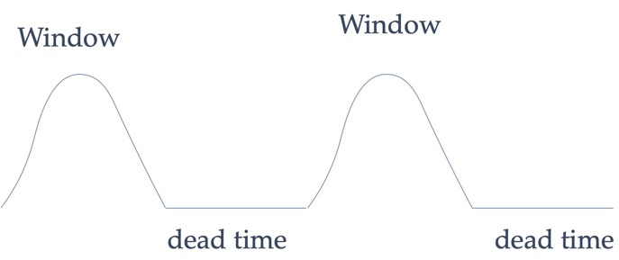

### Window functions
[Window functions](https://de.wikipedia.org/wiki/Fensterfunktion)

### Implementation

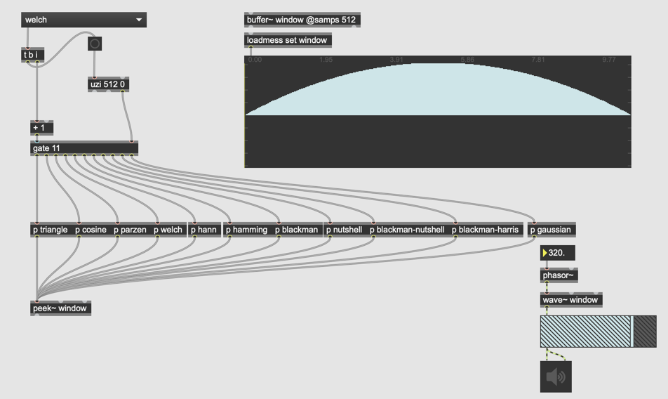

[Download MaxPatch](K7/patches/Window.maxpat)

### Blackman-Harris Window
Blackman-Harris window is generally used for WFS (but other windows can be also used)

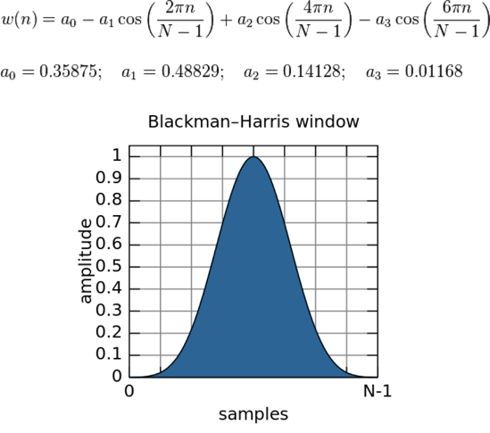

### Implementation Blackman-Harris

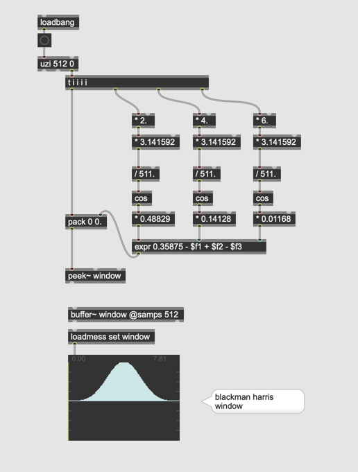  
Hint: you can extract this from the patch above.

### Wrong implementation

This is not a real WFS, because the duty cycle (the samples used for rendering window) is scaled by the frequency of the phasor and the duty cycle parameter.

### Assignment 5 : real WFS

In the patch above, the duty cycle can be specified by the ratio (e.g. 0.5 = the half of the period is used for window, the other half for silence). Modify the patch enable the users to input duty cycle not by the ratio but by the **absolute number of samples** used for the rendering window.

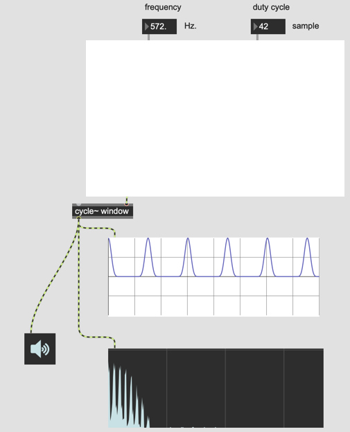

Then, compare the spectrum between this implementation and previous implementation.

### Slot-Weighting

The timber of WFS can be further controlled by the technique called slot-weighting.

In slot-weighting, the amplitude of each window is varied arbitrary by the sequence called slot weights.

The number of windows in one sequence is also arbitrary.

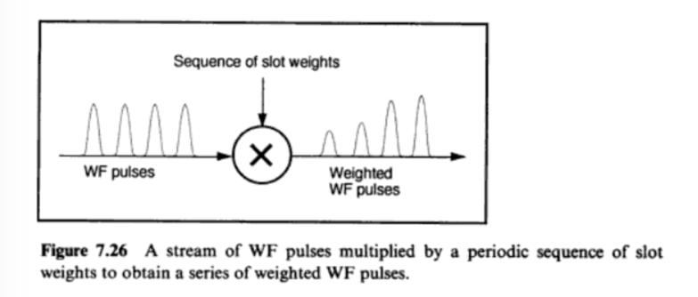

### Assignment 6: Slot-weighting

Add a multislider to the patch and enable the user to control the slot weights for the sequence of N windows. Below, you will find a patch that allows the user to set up the slot weights and copy them to the buffer~.

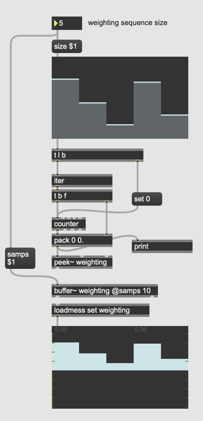

Combine the patch for assigment 5 and this patch to apply the slot-weighting to the WFS patch.

