# Ka7 Formant Synthesis

### Formant

- A Formant is a peak of energy in a spectrum, which can include both harmonic and inharmonic partials as well as noise. 

- Formant peaks are a characteristic of the spoken vowel sounds and the tone color of many musical instruments.

### Formant Creation with AM

#### AM

### Assignment 1

The modulator of the AM synthesis generates a unipolar signal. This is a useful tool to imitates formant but the number of sideband is limited to 2. By calculating this unipolar signal to the **Nth** power, we can interpolate unipolar sine wave and impulse.

By Applying this **exponential AM** to the carrier signal, we can generate more sidebands from AM.

Add a number box to the AM patch and implement the exponential AM to control the number and the strength of sidebands. Then, observe the spectral transition when N = 1, N = 3 or N = 5.

### VOSIM

Vosim = Voice Simulator

> The VOSIM waveform approximates the signal generated by the human voice in the form of a series of pulse trains, where each pulse is the square of a sine function. 
>

#### Parameter

- The parameter A sets the amplitude of the highest pulse.
- Each of the pulse trains contains N sin^2 pulses in series
- The pulses decreases in amplitude by a decay factor b
- The width (duration) of each pulse T determines the position of the formant spectrum
- A variable-length delay M follows each pulse train
- The period is N x T + M

### Umsetzung in Max

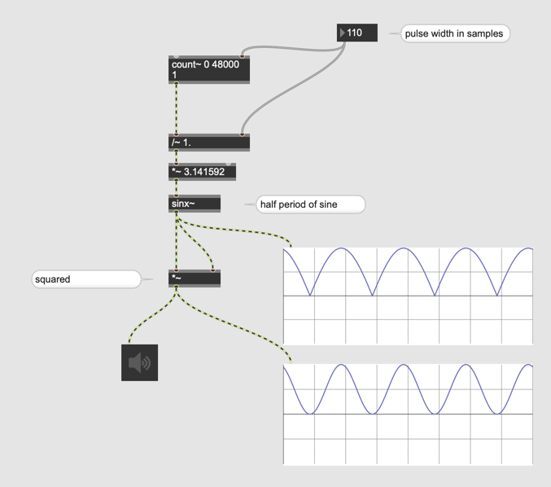

### delay
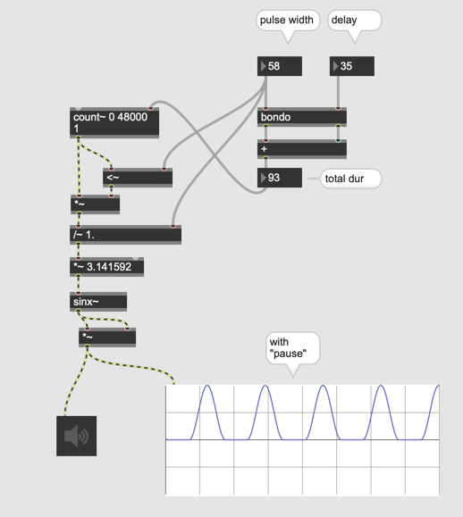

### n Pulse
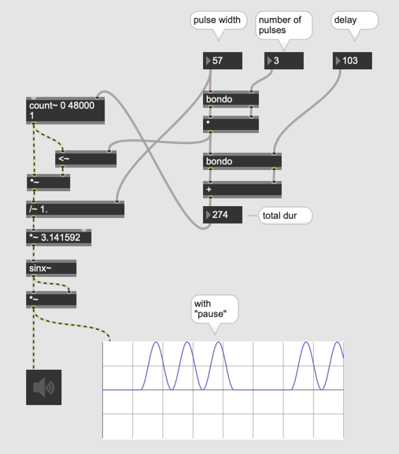

### b factor
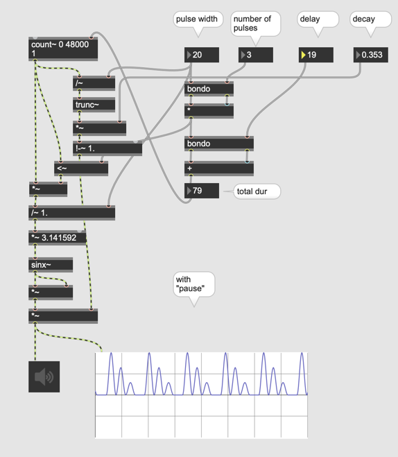

## Window Function Synthese

## Die Beziehung zwischen DutyCycle und Obert￿öne

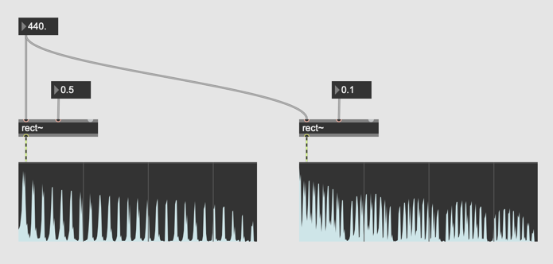

### Vershiedene Fenterfunktionen

[Fensterfunktionen Wikipedia](https://de.wikipedia.org/wiki/Fensterfunktion)

### Umsetzung von Fensterfunktion

[MaxPatch](K7/patches/Window.maxpat)

### Blackman-Harris Window

### Umsetzung von Blackman-Harris

### Duty Cycle

### Feste Dauer von Puls

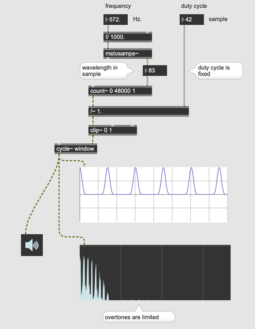

### Slot-Weighting

### Buffer - Multislider Synchronisierung

### Slot-Weighting in Signal-Bereich

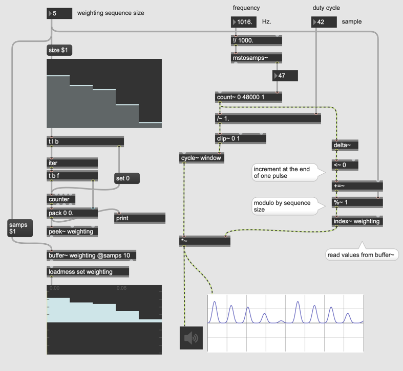

## FOF

> FOF generates a stream of grains, each separated by a quantum of time, corresponding to a period of fundamental frequency

Wellenform: Sinus  
H￿üllkurve: schnelle Attack und exponentielle Decay

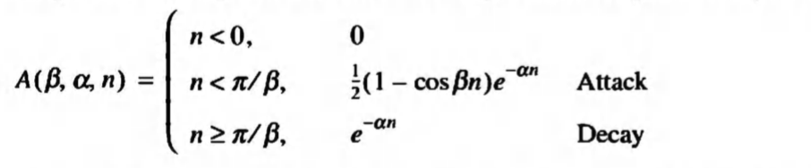

n … sample in time  
β … attack sharpness  
α … decay control  

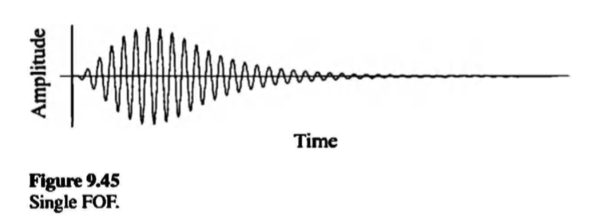

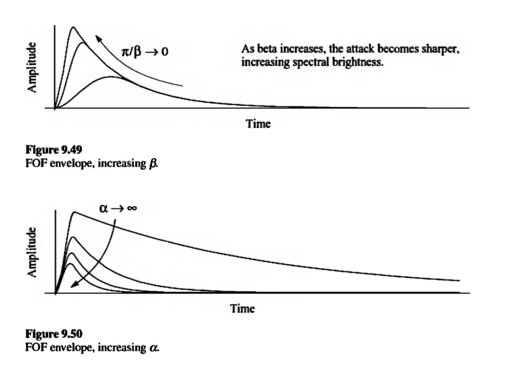

### Release

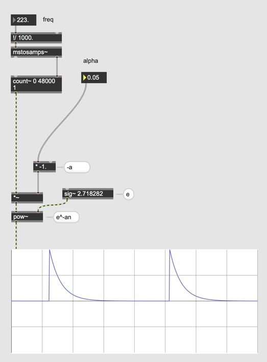

### Attack

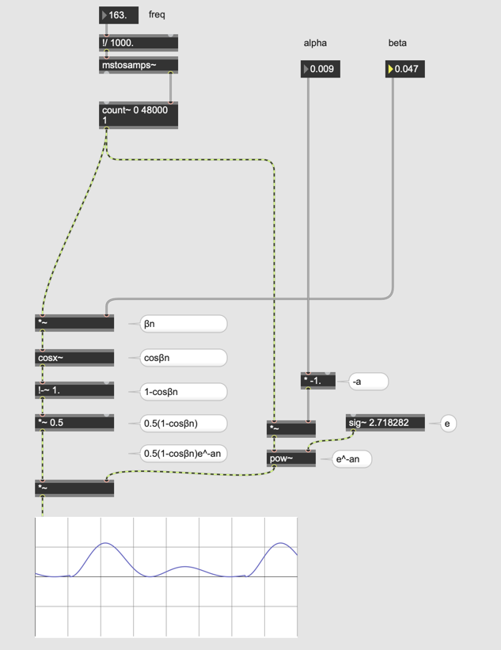

### Kombination

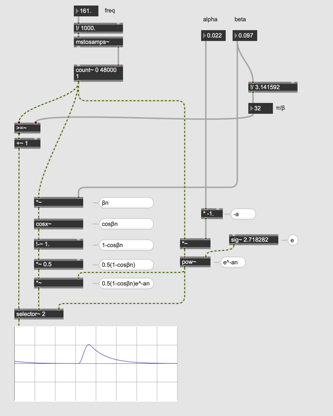

### mit Sinus

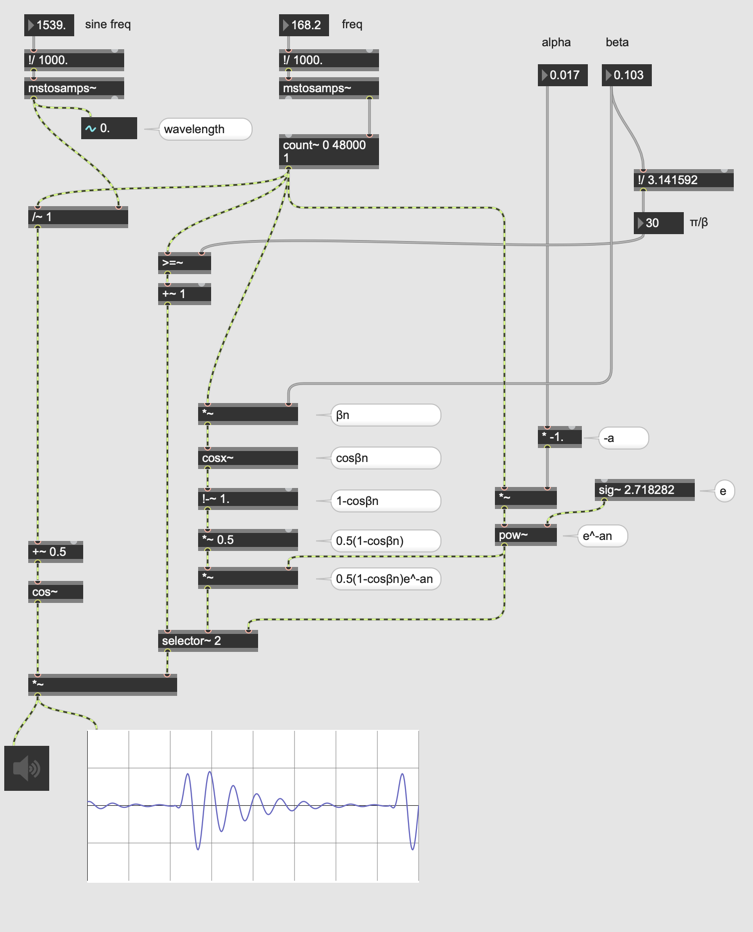

