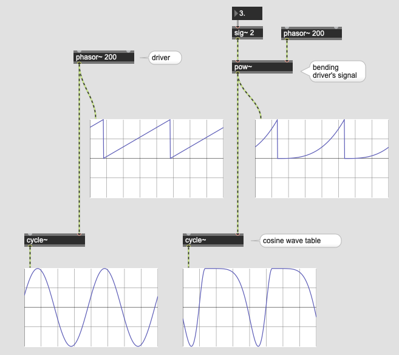
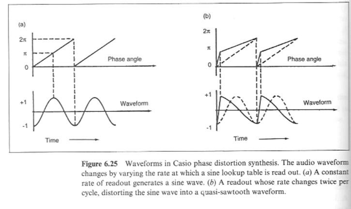
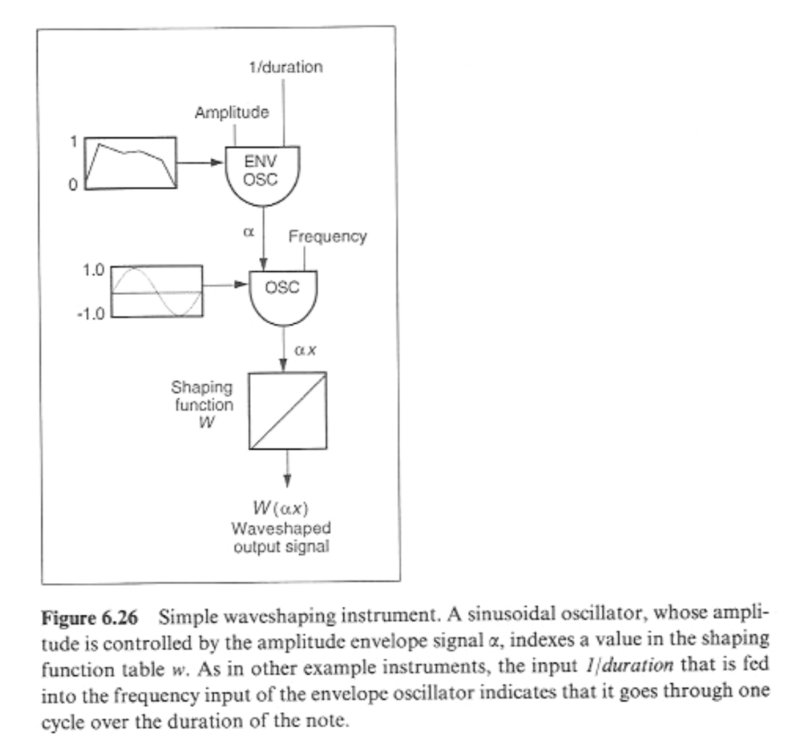
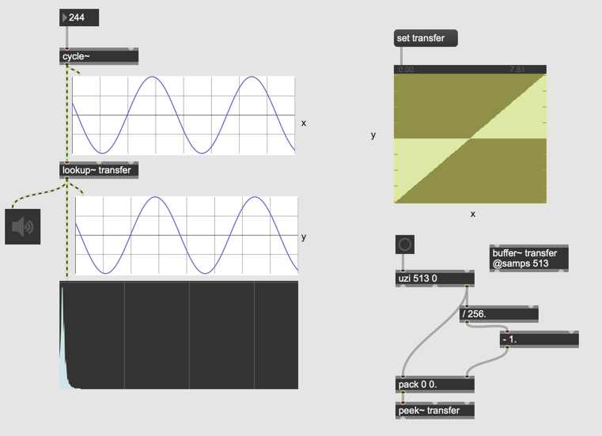
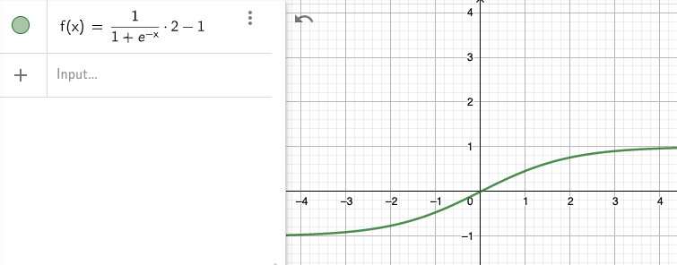

# K8 Distortion Synthesis 

## Phase-Distortion Synthesis

We can separate wavetable and its **driver** using cycle~'s right inlet.

In the patch above the driver is a simple phasor ,but we can use different signal as a driver.
For example, in the patch below, we modify the phasor signal by pow~ and bend the driver signal. As a result, the output from cycle~ is also distorted accordingly.

### Assignment1
Phase Distortion synthesis uses a special driver signal with a "knee". The ramp before the knee is faster and the point of knee is controllable.

- Study "kink~" object and implement phase distortion synthesis.
- Use table other than cosine wave and extend the concept of phase distortion synthesis

## Wave Terrain Synthesis

With Phase Distortion synthesis we learned that we can separate table and driver and control them separately. Wave terrain synthesis brings the idea of this two-way freedom in 3 dimensional field as shown in the figure below.

In Wavetable synthesis, the wavetable is depicted in 2D space and with a driver we give X value and get Y value.

In Wave terrain synthesis, the wave terrain is depicted in 3D space and with a driver we give X Y value and get Z value.

### Optional Assignment:
Try implementing wave terrain synthesis in Max.
Hint: jit.matrix would be useful to store the wave terrain. jit.peek~ also comes in handy to refer to the data stored in jit.matrix as an audio signal.

## Waveshaping
One of the problems of the synthesized sound is it is not dynamic enough in terms of timbre compared to acoustic instrument.

By checking the spectrum of ff sound of a trumpet and compare it with the pp sound, we can easily observe the spectral dynamism of the acoustic instrument.

Waveshaping tries to solve this problem by distorting the waveform based on its **amplitude**.

### Implementation in Max

### Assignment 1

Fill the transfer function buffer with the **logistic** function, where -4 < x < 4 and observe how the timbre changes by changing the amplitude of the sinewave.

### Assignment 2
As drawn in the DSP diagram (Figure 6.26),
Apply the amplitude envelope to the oscillator that generate sinewave that is sent to the waveshaper in order to increase the dynamism of the sound in terms of both timbre and volume. 
