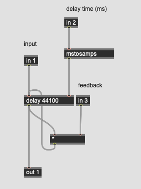
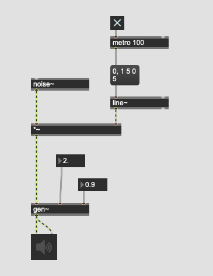
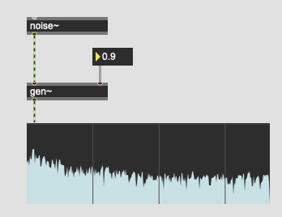
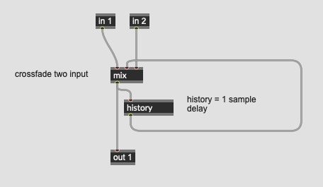

# K9 Karplus-Strong synthesis

### Assignment 1
create a noise burst, a very short period of noise (less than 10 msec) using noise~.

### Assignment 2
Apply a feedback delay to the noise burst, apply  very short feedback time (5 msec) and very high feedback ratio (95%), and listen to the sound carefully. 

Note: Set the signal vector size to 128

## Technical limitation

In max, feedback delay using tapin~ and tapout~ is limited to the vector size. 

The feedback delay shorter than the signal vector size can be only implemented in gen~

### Implementation in gen~  

### Assignment 3
By controlling the delay time, we can control the pitch of the KS synthesis. Add a kslider to the patch and enables the user to control the pitch by kslider.

### Assignment 4
By applying the lowpass filter in the feedback delay, change the timbre of PS synthesis (damping effect)

Here is a hint: how to create a lowpass in gen~

